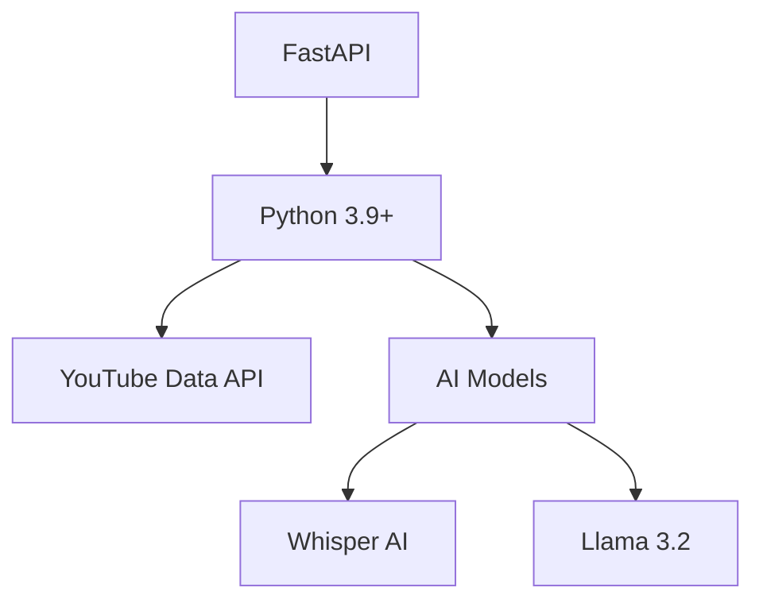

# YouTube Video Analyzer Pro

[](https://fastapi.tiangolo.com)
[](https://www.python.org)
[](https://openai.com/research/whisper)
[](https://ai.meta.com/llama/)
[](https://opensource.org/licenses/MIT)
[](https://github.com/KazKozDev/video-analyser/pulls)
[](https://developers.google.com/youtube/v3)
[](https://github.com/KazKozDev/video-analyser)

## 🌟 Overview

YouTube Video Analyzer Pro is a cutting-edge tool that brings professional-grade video analysis capabilities to content creators and viewers alike. Leveraging advanced AI technologies, it provides deep insights into video content, audience engagement, and market positioning.

## ✨ Key Features

### 🧠 AI-Powered Content Analysis
- **Smart Summarization**
  - Generate concise, intelligent video summaries using Llama 3.2 AI
  - Extract key topics and main points automatically
  - Identify crucial timestamps and segments

### 🎯 Advanced Transcription System
- **Multi-Layer Transcription**
  - Primary: YouTube's native transcription API
  - Backup: Whisper AI for videos without existing transcripts
  - Smart timestamps with topic segmentation
  - Custom processing for cleaner output

## 🎬 Demo Preview


### 🌍 Professional Translation Hub
- **Enterprise-Grade Translation Support**
  ```
  🇬🇧 English  →  Source Language
  🇪🇸 Spanish  →  Native Quality
  🇫🇷 French   →  Professional Grade
  🇩🇪 German   →  High Accuracy
  🇮🇹 Italian  →  Natural Flow
  🇷🇺 Russian  →  Precise Translation
  ```

### 💬 Comment Intelligence
- **Sentiment Analysis**
  - Emotional tone detection in comments
  - Key themes and patterns identification
  - Audience sentiment tracking
  - Controversy detection
- **Engagement Metrics**
  - Comment frequency analysis
  - User interaction patterns
  - Community feedback categorization
- **Strategic Insights**
  - Viewer pain points identification
  - Content improvement suggestions
  - Community engagement opportunities

### 🔍 Content Discovery Engine
- **Channel Analysis**
  - Similar video recommendations
  - Content pattern detection
  - Performance metric tracking
- **Competitor Intelligence**
  - Related content from other creators
  - Niche trend analysis
  - Market positioning insights

## 🛠️ Technology Stack

### Backend Infrastructure


### AI Processing Pipeline
- **Speech Recognition**: Whisper AI
- **Content Analysis**: Llama 3.2 (Ollama llama3.2-vision:11b model)
- **Translation Engine**: Custom AI Pipeline
- **Comment Analysis**: Advanced NLP Models

### Frontend Architecture
- **Framework**: React
- **UI Components**: Modern Material Design
- **Data Visualization**: Dynamic Charts
- **Responsive Design**: Mobile-First Approach

## ⚡ Performance & Scalability

### Free Tier Benefits
- Full access to all features
- Unlimited video analysis
- Complete comment processing
- All languages supported

### ⚡ Processing Times

| Operation | Short Videos (<10min) | Long Videos (>10min) |
|-----------|---------------------|-------------------|
| 🔍 Basic Analysis | ~30 seconds | 1-2 minutes |
| 📝 Transcription | 1-2 minutes | 3-5 minutes |
| 🌍 Translation | 2-3 minutes | 5-10 minutes |
| 💬 Comment Analysis | 1-2 minutes | 2-3 minutes |

Note: Processing times may vary depending on server load and video complexity. All operations run locally for maximum privacy and security.

## 🚀 Getting Started

### System Requirements
- Python 3.9+
- 8GB RAM minimum
- GPU recommended for faster processing
- YouTube API Key
- Ollama installed (for Llama 3.2 model)

### Installing Ollama and Llama Model
1. **Install Ollama**
   ```bash
   # For Linux/WSL
   curl -fsSL https://ollama.com/install.sh | sh
   
   # For macOS
   brew install ollama
   
   # For Windows
   # Download from https://ollama.com/download
   ```

2. **Download Llama Model**
   ```bash
   # Start Ollama service
   ollama serve

   # In a new terminal, pull the model
   ollama pull llama3.2-vision:11b
   ```

   Note: The model is approximately 11GB in size, so ensure you have sufficient disk space and a stable internet connection.

### Quick Start
1. **Clone & Setup**
   ```bash
   git clone https://github.com/KazKozDev/video-analyser.git
   cd video-analyser
   ```

2. **Environment Setup**
   ```bash
   python -m venv venv
   source venv/bin/activate  # Windows: venv\Scripts\activate
   pip install -r requirements.txt
   ```

3. **Configuration**
   ```bash
   cp .env.example .env
   # Add your YouTube API key to .env
   ```

4. **Launch**
   ```bash
   uvicorn server:app --reload
   ```

Visit `http://localhost:8000` and start analyzing! 🎉

## 📊 Use Cases

### Content Creators
- **Channel Optimization**
  - Content performance analysis
  - Audience retention insights
  - Engagement optimization
  - Competitor research
  - Multilingual reach expansion

### Marketing Teams
- **Market Research**
  - Trend analysis
  - Competitor tracking
  - Audience insights
  - Content strategy development

### Researchers & Analysts
- **Data Collection**
  - Transcript extraction
  - Comment analysis
  - Engagement metrics
  - Cross-channel comparisons

## 🤝 Contributing

We welcome contributions! Check our [Contributing Guide](https://github.com/KazKozDev/video-analyser/blob/main/CONTRIBUTING.md) for more information.

1. Fork the repo
2. Create a feature branch
   ```bash
   git checkout -b feature/amazing-feature
   ```
3. Commit changes
   ```bash
   git commit -m 'Add amazing feature'
   ```
4. Push to the branch
   ```bash
   git push origin feature/amazing-feature
   ```
5. Open a Pull Request

## 📝 License

Distributed under the MIT License. See [LICENSE](https://github.com/KazKozDev/video-analyser/blob/main/LICENSE) for more information.

## 🙏 Acknowledgments

- OpenAI for the incredible Whisper AI
- Meta for Llama 3.2
- YouTube API Team
- All contributors and supporters

## ⭐ Support the Project

If you found this tool useful, consider:
- Giving it a star ⭐
- Sharing it with others
- Contributing to its development
- Reporting issues or suggesting features

## 📧 Contact

KazKozDev - [@KazKozDev](https://github.com/KazKozDev)

Project Link: [https://github.com/KazKozDev/video-analyser](https://github.com/KazKozDev/video-analyser)

---

<div align="center">
  Made with ❤️ for the YouTube community
  <br>
  <a href="https://github.com/KazKozDev/video-analyser/stargazers">⭐ Star us on GitHub!</a>
</div>